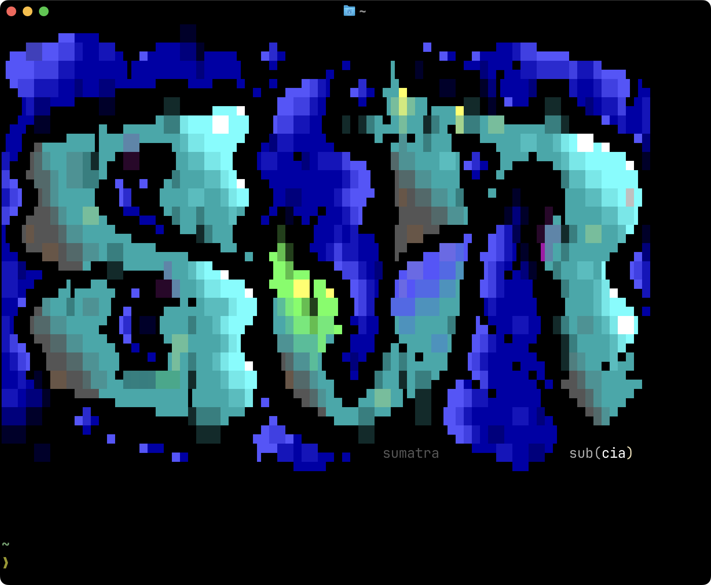

# ansimotd

Display random ANSI art as your message of the day. For a browser version, visit [ansimotd.com](https://ansimotd.com).

Selects a random ANSI art file with valid [SAUCE metadata](https://www.acid.org/info/sauce/sauce.htm), ensures it fits your terminal width, and renders it with accurate VGA colors using 24-bit true-color escape sequences.

Art is sourced from [16colo.rs](https://16colo.rs/).



## Color accuracy

ANSI art was designed for the DOS/VGA 16-color palette. Modern terminals remap these colors to their own theme, which can significantly distort the artwork. ansimotd converts standard ANSI color codes to 24-bit true-color escape sequences using the exact VGA RGB values, so art displays accurately regardless of your terminal's color scheme.

## Installation

```bash
go install github.com/retlehs/ansimotd@latest
```

## Usage

### Display art

```bash
# Display a random ANSI art file
ansimotd

# Display a specific file
ansimotd display --file /path/to/art.ans
```

### Download art

```bash
# Download all packs from a specific year
ansimotd download 1996

# Filter by group
ansimotd download 1996 --group ice

# Download a specific pack
ansimotd download 1999 --pack bmbook20
```

The `download` command fetches packs from the [16colo.rs API](https://16colo.rs/), extracts ANSI files, and stores them locally. Packs that have already been downloaded are skipped on re-run.

### Shell integration

Add to your shell RC file (`.bashrc`, `.zshrc`, etc.):

```bash
ansimotd
```

### Other commands

```bash
# Print the path of the last displayed file
ansimotd last

# Print version
ansimotd --version
```

## Configuration

| Environment variable | Description | Default |
|---|---|---|
| `ANSIMOTD_DIR` | Root directory for all ansimotd data | `$XDG_CONFIG_HOME/ansimotd` or `~/.config/ansimotd` |

All paths derive from the root:

| Path | Purpose |
|---|---|
| `$ROOT/art/` | Downloaded art packs |
| `$ROOT/last` | Path to the last displayed file |

## Credits

Based on [zsh-ansimotd](https://github.com/yuhonas/zsh-ansimotd) by yuhonas, with significant modifications including accurate VGA color rendering, SAUCE-aware line wrapping, and the 16colo.rs download client.
